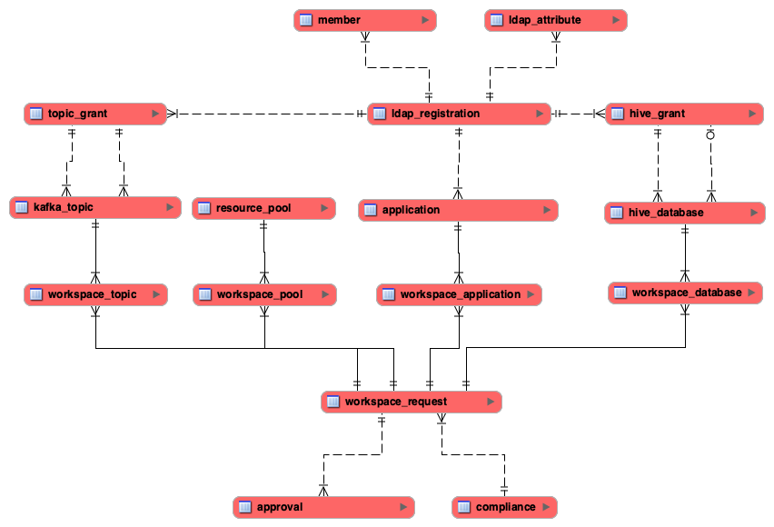

## Archway API

Archway API is the REST interface primaly enabling functionality to it's UI counterpart but also a means for automation.

### Code

All backend code is written in Scala with support of scala libraries.

#### What's Being Used?

- [Cats](https://typelevel.org/cats/) for better abstractions for functional programming.
- [Cats effect](https://github.com/typelevel/cats-effect) for handling side effects.
- [Circe](https://github.com/circe/circe) for parsing JSON.
- [Doobie](https://tpolecat.github.io/doobie/) for providing pure functional connection with database.
- [Http4s](https://http4s.org) for handling http requests.

#### Structure

The code is comprised of a few primary packages:

- REST API - `io.phdata.rest`
  Responsible for serving requests via HTTP.
- Startup - `io.phdata.startup`
  Responsible for managing initial (and often repeating) tasks.
- Clients - `io.phdata.clients`
  Responsible for interacting with third party integrations like CM API.
- Config - `io.phdata.config` Responsible for parsing configuration into case classes.
- Generators - `io.phdata.generators` Responsible for automation of creating specific application objects.
- Models - `io.phdata.models` Responsible for representing the domain model of the application.
- Provisioning - `io.phdata.provisioning`
  Responsible for applying metadata to the cluster and resources requested.
- Repositories - `io.phdata.repositories`
  Responsible for managing interactions with the meta database.
- Services - `io.phdata.services`
  Responsible for providing business logic.

### Database

The metadata for Archway is broken up into two main parts: workspace metadata and application configuration. Visualization of database schema can be found in `Archway.mwb` (can be open with [MySQL Workbench](https://www.mysql.com/products/workbench/)).

#### Workspace Metadata

All workspaces can contain a collection of topics, applications, databases, and resource pools. Depending on the template
used, a workspace is stored and when applied, timestamps on the related entity are updated to indicate progress.


#### Configuration


### Integration test module

An Integration test module contains test for verifying application crucial parts, those tests use real services.

An integration test jar is included in the parcel at \$PARCELS_ROOT/ARCHWAY/usr/lib/archway-server/archway-test.jar

Run tests by adding your application.conf to the classpath and choosing a test:

````bash
java -cp "/path/to/application.conf:cloudera-integration/build/ARCHWAY-1.5.1/usr/lib/archway-server/*:cloudera-integration/build/ARCHWAY-1.5.1/usr/lib/archway-server-tests/*" org.scalatest.tools.Runner -o -R cloudera-integration/build/ARCHWAY-1.5.1/usr/lib/archway-server-tests/archway-integration-tests.jar -q Spec```bash

When run in a dev environment this looks like:

```bash
java -cp "common/src/test/resources/application.test.conf:integration-test/target/scala-2.12/archway-test.jar" org.scalatest.run io.phdata.clients.LDAPClientImplIntegrationSpec
````

Build the test jar locally with

```bash
make package-tests
```

Create integration tests with `make package-tests`.

## Archway UI

Archway UI is a web application for managing resources.

### What's Being Used?

- [React](http://facebook.github.io/react/) for managing the presentation logic of your application.
- [Redux](http://redux.js.org/) + [Redux-Immutable](https://github.com/gajus/redux-immutable/) + [Reselect](https://github.com/reduxjs/reselect/) for generating and managing your state model.
- [Redux-Saga](https://github.com/redux-saga/redux-saga/) for managing application side effects.
- [Antd](https://ant.design/) for ui elements such as sidebar, dropdown, card, etc.
- [Formik](https://github.com/jaredpalmer/formik/) and [Redux-Form](https://redux-form.com/) for handling forms efficiently.
- [Fuse](http://fusejs.io/) for fuzzy-search feature.
- [React-Csv](https://github.com/react-csv/react-csv/) for exporting data in csv format.
- [Lodash](https://lodash.com/) for using various utility functions.
- [Node](https://nodejs.org) Version 8.x
- [NPM](https://npmjs.com) Version 5.x

### File Structure

#### public/

In this folder is a default `index.html` file for serving up the application. Fonts used by application also reside here.

###### images/

Folder containing image assets used in the application.

#### src/

The client folder houses the client application for your project. This is where your client-side Javascript components, logical code blocks and image assets live.

###### components/

Here reside the components that are used globally, such as ListCardToggle, Behavior and WorkspaceListItem.

###### containers/

Here we have containers, the components that are connected to redux. Each container has its own actions, reducers, sagas and selectors. Every routes of the app has their relevant containers. The sub-directory names indicate what route they are pointing. Some containers has subfolder named `components` that includes components used for that specific container.

###### models/

Here we define all the models used for the application, including Workspace and Cluster.

###### redux/

Global reducers and sagas of the application stays here.

###### service/

Here resides the code for making api calls.
